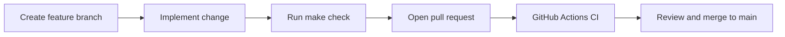
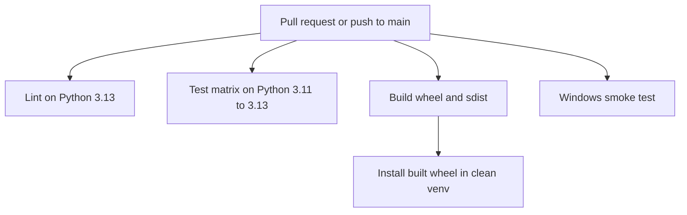
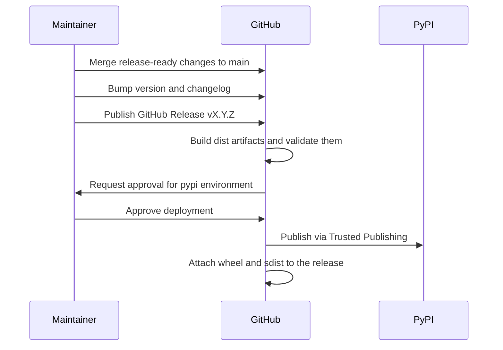

# Development Guide

Setup, testing, and release instructions for `timelineviz`.

`timelineviz` now targets Python 3.11 and newer.

## Makefile

The repository root includes a `Makefile` for routine tasks. It invokes **`uv`** by default; override with `make UV=path/to/uv` if needed. Run **`make`** or **`make help`** to print the same target list as below.

| Target | Description |
|--------|-------------|
| `install` | `uv sync --all-extras` — editable project environment with dev tools |
| `sync` | `uv sync --locked --all-extras` — exact project environment from `uv.lock` |
| `lock` | `uv lock` — refresh `uv.lock` after dependency changes |
| `lint` | `uv run ruff check .` |
| `format` | `uv run ruff format .` |
| `format-check` | `uv run ruff format --check .` |
| `test` | `uv run pytest` with coverage (uses `[tool.pytest.ini_options]` in `pyproject.toml`) |
| `test-html` | Same as `test`, plus HTML coverage under `htmlcov/` |
| `test-verbose` | `pytest -v` |
| `test-no-cov` | Pytest without coverage (`-o addopts=`) |
| `build` | `uv build` → `dist/` |
| `dist-check` | `uv run twine check --strict dist/*` |
| `check` | Local pre-PR gate: lint, format-check, tests, build, and dist validation |
| `clean` | Remove `dist`, `build`, `htmlcov`, pytest and coverage caches, `*.egg-info`, and `__pycache__` (skips `.venv` and `.git`) |
| `publish` | Manual PyPI publish fallback (prefer the GitHub Release-driven workflow) |
| `version` | Print `timelineviz.__version__` |
| `cli-help` | `timelineviz --help` |
| `precommit-install` | Install the local pre-commit git hook |
| `example-charts` | Regenerate documentation images (`examples/gen_charts.py`) |
| `example-event-log` | Run CLI `--event-log` on `examples/incident_log.csv` (override `EVENT_LOG_CSV`, `EVENT_LOG_OUT`) → `event_log_timeline.png` |

Override the test runner with `make PYTEST=pytest …` if required.

## Setup

```bash
git clone https://github.com/garrywilliams/timeline_viz.git
cd timeline_viz
make install
make precommit-install

# Re-sync to the committed lockfile when dependencies change locally
make sync
```

## Local Workflow

Use the same order locally that CI uses:

```bash
make lint
make format-check
make test
make build
make dist-check
```

For a full pre-PR pass:

```bash
make check
```

To auto-format files before committing:

```bash
make format
```

`pre-commit` runs the same Ruff hooks on changed files at commit time once `make precommit-install` has been run.

## Testing

```bash
make test
make test-html    # then open htmlcov/index.html
make test-no-cov  # faster iteration without coverage
```

Equivalently, with `uv` and the project on the path:

```bash
uv run pytest
uv run pytest --cov-report=html
open htmlcov/index.html   # macOS
```

Coverage threshold is 90 % (enforced in `pyproject.toml`).

## Contributor Workflow



Recommended branch workflow:

1. Create a short-lived branch from `main`.
2. Make the change and run `make check`.
3. Open a pull request and wait for CI to pass.
4. Merge with squash merge unless there is a good reason to preserve individual commits.

## CI/CD Workflow

The repository now uses two GitHub Actions workflows:

- `ci.yml`: runs on pull requests and pushes to `main`; executes Ruff, the Python 3.11 to 3.13 test matrix, a packaging validation job, and a Windows CLI smoke test.
- `release.yml`: runs when a GitHub Release is published; rebuilds the distributions once, validates them, publishes the exact built artifacts to PyPI using Trusted Publishing, and attaches them to the GitHub Release.
- `.github/release.yml`: customizes GitHub's built-in generated release notes so releases group merged PRs into consistent sections.



## Release Process

The preferred release flow is now automated from GitHub Releases. Maintainers still decide when to release, but the build and publish path should run in GitHub Actions instead of from a laptop.



## Project Layout

```
src/timelineviz/
    __init__.py       # Public API re-exports
    _version.py       # Single source of truth for version
    timeline.py       # CSV/DataFrame visualisation
    promtest.py       # Prometheus test file parser + visualiser
    utils.py          # Shared helpers
    cli.py            # CLI entry point (wide CSV, --event-log, --promtest)
    py.typed          # PEP 561 marker
    tests/
        test_timeline.py
        test_promtest.py
        test_utils.py
        test_cli.py
```

Long-format logs (one timestamp column across many rows, optional row filters) are handled by `plot_event_log_timeline` in `timeline.py` and by CLI flags `--event-log` and `--log-*` (see README).

## Building

```bash
make build
# or: uv build
# outputs dist/timelineviz-x.y.z-py3-none-any.whl (and sdist)
```

## Maintainer Release Checklist

1. Land all release content on `main`.
2. Bump the version in `src/timelineviz/_version.py`.
3. Update `CHANGELOG.md`.
4. Run `make check`.
5. Commit the release metadata and push `main`.
6. Create a GitHub Release for `vX.Y.Z`, targeting `main`.
7. If the tag does not already exist, let GitHub create it as part of the release.
8. Use GitHub's generated release notes.
9. Publish the release.
10. Wait for `.github/workflows/release.yml` to start, approve the protected `pypi` environment, and let GitHub Actions publish.

If you use labels on pull requests, GitHub will use `.github/release.yml` to group them into sections like Features, Fixes, Documentation, and Dependencies.
The fallback `Other Changes` section means release notes still work even if a PR was unlabeled.

CLI equivalent:

```bash
gh release create vX.Y.Z --target main --generate-notes
```

## One-Time GitHub and PyPI Setup

Before the automated release flow can publish, configure the repository and PyPI once:

1. Create a GitHub environment named `pypi`.
2. Add at least one required reviewer for that environment and disable self-approval if that fits your maintainer model.
3. In PyPI, add a Trusted Publisher for this repository with:
   - Owner: `garrywilliams`
   - Repository: `timeline_viz`
   - Workflow file: `release.yml`
   - Environment: `pypi`
4. Protect `main` with required pull requests and required status checks from the CI workflow.

The workflow file name matters because PyPI validates it when exchanging the GitHub OIDC token for a short-lived publish token. The standard maintainer action is now publishing a GitHub Release rather than pushing a raw tag by itself.
