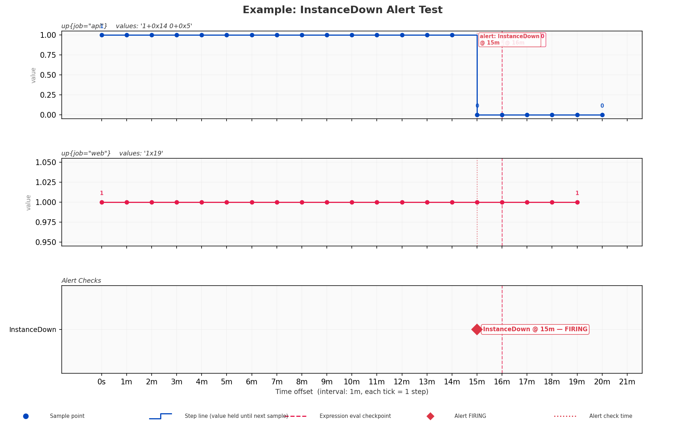
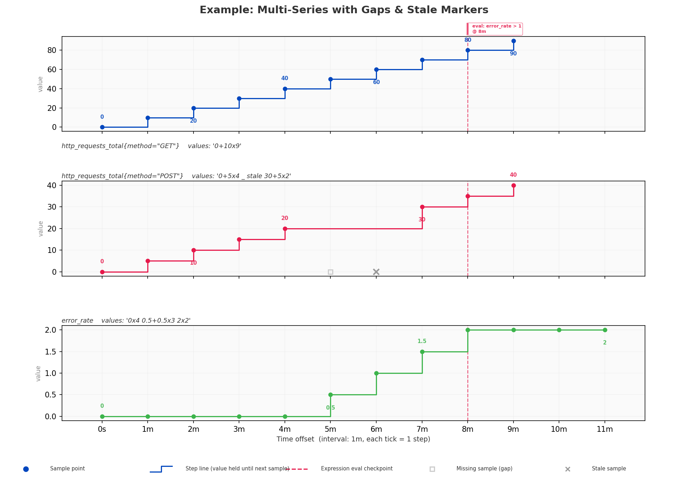

# Prometheus Test Visualisation

Visualise [promtool unit-test](https://prometheus.io/docs/prometheus/latest/configuration/unit_testing_rules/) YAML files as timeline charts — see how series values evolve, where evaluations happen, and when alerts fire.

## Overview

A promtool test file defines metric series as values over discrete time steps and then asserts the results of PromQL expressions or alerting rules at specific points. This module parses those files and produces a multi-panel chart:

- **One subplot per `input_series`** — step plot of metric values over relative time
- **Vertical dashed lines** at `eval_time` checkpoints (red for expression tests, dotted for alert checks)
- **Alert status markers** — diamonds for FIRING, circles for pending
- **Gap and stale indicators** — hollow squares for missing samples (`_`), × marks for `stale`
- **Relative x-axis** — labels like `0s`, `1m`, `2m` rather than real timestamps

## Usage

### CLI

```bash
# Display interactively
timelineviz my_rules_test.yml --promtest

# Save to file without displaying
timelineviz my_rules_test.yml --promtest --output-dir images --no-show

# Custom size and resolution
timelineviz my_rules_test.yml --promtest --figsize 18,10 --dpi 300

# Split the chart when eval/alert times are far apart (like CSV long-gap breaks)
timelineviz examples/promtest_time_breaks.yml --promtest --promtest-break-gap 40 \
  --output-dir images --no-show
```

Anchors for breaks are **`0`**, the **end of the series timeline**, and **every** `eval_time` / alert `eval_time`. If the gap between two consecutive anchors (in minutes) is greater than `--promtest-break-gap`, the figure uses **multiple horizontal panels** with slash markers between them, similar to wide-format CSV timelines and `threshold_days`.

### Label overlap (`--promtest-label-layout`)

Dense tests often stack eval lines, value callouts, and alert text in the same region. Use:

| Value | Behaviour |
|-------|-----------|
| **`readable`** (default) | Stagger eval/alert boxes in rows above the first series; thin value labels along steps with a minimum horizontal gap and alternating above/below; stack alert annotations when they share the same time. |
| **`compact`** | Stronger truncation and fewer step value labels (larger minimum gap, smaller fonts). |
| **`legacy`** | Original placement (matches older releases). |

```bash
timelineviz my_test.yml --promtest --promtest-label-layout compact --no-show
```

### Python API

```python
from timelineviz import parse_promtest_file, parse_promtest_string, plot_promtest

# From a file
groups = parse_promtest_file("my_rules_test.yml")
results = plot_promtest(groups, output_file="timeline.png")

# From a YAML string (handy in notebooks)
yaml_str = """
evaluation_interval: 1m
tests:
  - interval: 1m
    input_series:
      - series: 'http_requests_total{method="GET"}'
        values: '0+10x15'
    promql_expr_test:
      - expr: rate(http_requests_total[5m])
        eval_time: 10m
        exp_samples:
          - labels: 'http_requests_total{method="GET"}'
            value: 0.1666
"""
groups = parse_promtest_string(yaml_str)
plot_promtest(groups)

# Optional: break the x-axis across long idle gaps (minutes between anchors)
plot_promtest(groups, break_gap_minutes=60)

# Optional: reduce overlapping labels
plot_promtest(groups, label_layout='compact')
```

### Jupyter Notebook

```python
from timelineviz import parse_promtest_string, plot_promtest

# plot_promtest returns a list of (figure, axes) tuples — one per test group
results = plot_promtest(groups, show_plot=False)
fig, axs = results[0]
fig  # renders inline in Jupyter
```

## Promtool Notation Reference

This section summarises the promtool value notation so charts are easier to interpret.

### Durations

Used for `evaluation_interval`, `interval`, and `eval_time`:

| Example | Meaning |
|---------|---------|
| `1m`    | 1 minute |
| `5m`    | 5 minutes |
| `1h30m` | 1 hour 30 minutes |
| `2d`    | 2 days |
| `500ms` | 500 milliseconds |

### Series Value Notation

Each space-separated token in a `values` string represents one or more time steps:

| Token | Expansion | Description |
|-------|-----------|-------------|
| `42` | `42` | Single sample |
| `1+2x3` | `1 3 5 7` | Start at 1, increment by 2, repeat 3 more times (4 total) |
| `10-3x2` | `10 7 4` | Start at 10, decrement by 3, repeat 2 more times (3 total) |
| `5x4` | `5 5 5 5 5` | Repeat 5 four more times (5 total) |
| `_` | *(missing)* | One missing/gap sample |
| `_x3` | *(missing × 3)* | Three consecutive missing samples |
| `stale` | *(stale)* | Stale marker |

Tokens can be combined freely:

```yaml
values: '1+0x6 0+0x5'
# Expands to: 1 1 1 1 1 1 1 0 0 0 0 0 0
#             ^^^^^^^^^^^^^^^ ^^^^^^^^^^^
#             7 ones           6 zeros
```

### How Time Steps Map to the Chart

Given `interval: 1m` and `values: '0+1x4'`:

| Step | Time | Value |
|------|------|-------|
| 0 | 0m | 0 |
| 1 | 1m | 1 |
| 2 | 2m | 2 |
| 3 | 3m | 3 |
| 4 | 4m | 4 |

The chart plots these as a step function with dots at each sample.

## Worked Example

Given a test file for an `InstanceDown` alert:

```yaml
# rules_test.yml
evaluation_interval: 1m

tests:
  - interval: 1m
    input_series:
      - series: 'up{job="api"}'
        values: '1+0x14 0+0x5'
      - series: 'up{job="web"}'
        values: '1x19'

    alert_rule_test:
      - eval_time: 15m
        alertname: InstanceDown
        exp_alerts:
          - exp_labels:
              job: api

    promql_expr_test:
      - expr: up == 0
        eval_time: 16m
        exp_samples:
          - labels: 'up{job="api"}'
            value: 0
```

```python
from timelineviz import parse_promtest_file, plot_promtest

groups = parse_promtest_file("rules_test.yml")
plot_promtest(groups, title="InstanceDown Alert Test")
```

This produces:



**Reading the chart:**

1. **Top subplot** — `up{job="api"}`: value 1 for 0m–14m, drops to 0 at 15m. The raw notation `'1+0x14 0+0x5'` is shown in the italic subtitle below each series name.
2. **Middle subplot** — `up{job="web"}`: constant 1 across all 20 steps.
3. **Bottom row** (Alert Checks) — `InstanceDown` is marked FIRING at 15m with a red diamond and boxed label.
4. **Vertical markers** — dashed red line labelled `eval: up == 0 @ 16m` for the expression eval, dotted line for the alert check time.
5. **Value labels** appear above transition points (where the value changes) so you can read exact values without consulting a y-axis.
6. **Legend strip** at the bottom explains all marker types used in the chart.


## Multi-Series Example

A more complex example with gaps, stale markers, and multiple series:

```yaml
evaluation_interval: 1m
tests:
  - interval: 1m
    input_series:
      - series: 'http_requests_total{method="GET"}'
        values: '0+10x9'
      - series: 'http_requests_total{method="POST"}'
        values: '0+5x4 _ stale 30+5x2'
      - series: 'error_rate'
        values: '0x4 0.5+0.5x3 2x2'
    promql_expr_test:
      - expr: error_rate > 1
        eval_time: 8m
        exp_samples:
          - labels: 'error_rate'
            value: 2
```



**Things to notice:**

- The POST series has a **missing sample** (hollow square at 5m) and a **stale marker** (× at 6m) before resuming at 30.
- The error_rate series shows a **gradual ramp** from 0 → 0.5 → 1.0 → 1.5 → 2.0 then holds at 2.
- The eval line at 8m checks `error_rate > 1` — at that point the value is indeed 2.
- Each subplot's italic subtitle shows the raw promtool notation, making it easy to cross-reference with your YAML test file.

## API Reference

### Parsing

| Function | Description |
|----------|-------------|
| `parse_promtest_file(path)` | Parse a YAML file, returns `list[PromTestGroup]` |
| `parse_promtest_string(yaml_string)` | Parse a YAML string, returns `list[PromTestGroup]` |
| `parse_duration(s)` | Parse a Prometheus duration (`'5m'`) → `timedelta` |
| `expand_values(notation)` | Expand series notation (`'1+2x3'`) → `[1.0, 3.0, 5.0, 7.0]` |

### Data Model

| Class | Key Fields |
|-------|------------|
| `PromTestGroup` | `interval`, `series`, `eval_points`, `alert_checks`, `name` |
| `SeriesData` | `metric`, `labels`, `values`, `interval`, `raw_values`, `display_name`, `time_offsets` |
| `EvalPoint` | `expr`, `eval_time`, `expected_results` |
| `AlertCheck` | `alertname`, `eval_time`, `exp_alerts` |

### Visualisation

```python
plot_promtest(
    groups,                # list[PromTestGroup]
    figsize=None,          # (width, height) or auto-sized
    show_plot=True,        # display interactively
    output_file=None,      # save PNG path
    dpi=150,               # resolution
    title=None,            # custom figure title
    color_scheme=None,     # override PROMTEST_COLOR_SCHEME keys
)
# Returns list[(matplotlib.Figure, list[matplotlib.Axes])]
```

### Colour Scheme

Override any of these keys via the `color_scheme` parameter:

```python
{
    'series_colors': ['#0046be', '#e6194b', '#3cb44b', '#f58231',
                      '#911eb4', '#42d4f4', '#f032e6', '#bfef45'],
    'eval_line':      '#e6194b',   # eval_time vertical lines
    'alert_pending':  '#ffc107',   # pending alert markers
    'alert_firing':   '#dc3545',   # firing alert markers
    'grid':           '#e0e0e0',
    'background':     '#fafafa',
    'text':           '#333333',
    'stale_marker':   '#999999',   # × marks for stale samples
    'missing_marker': '#cccccc',   # □ marks for missing samples
}
```

## Limitations

- **No PromQL evaluation** — the chart shows raw input series and where checks happen, but does not compute derived expressions like `rate()` or `avg()`.
- **Alert state transitions are not computed** — we show whether `exp_alerts` is populated (FIRING) or empty (pending) at each `eval_time`, but we don't simulate the `for` duration logic.
- **Native histogram notation** is not yet supported — histogram-valued series will raise a parse error.
- **One figure per test group** — if your YAML has several `tests:` entries, each gets a separate figure.
