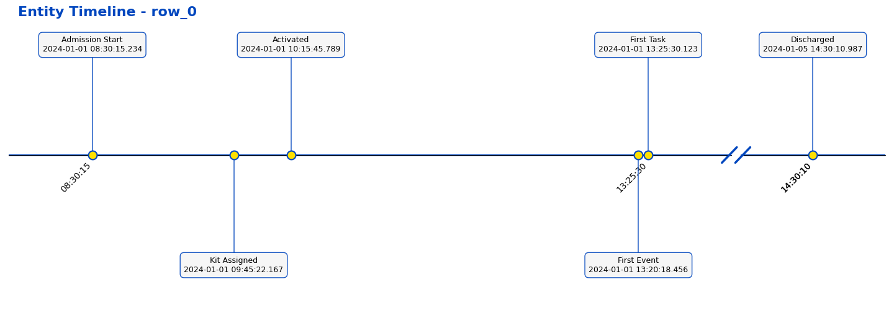

# Timeline Visualization

A Python library for creating timeline visualizations from CSV data.



## Features

- Create clean, professional timeline visualizations from any timestamp data
- Handle time gaps with broken timeline display
- Process multiple entities from CSV files
- Auto-detect timestamp columns based on naming patterns
- Customizable appearance with color schemes
- Command-line interface for non-programmers
- Python API for integration into notebooks and applications

## Installation

There are several ways to install Timeline Viz:

```bash
# Option 1: Install with uv (recommended for development)
curl -LsSf https://astral.sh/uv/install.sh | sh
uv pip install timeline-viz

# Option 2: Install with pipx (recommended for command-line tools)
pipx install timeline-viz

# Option 3: Build and install from source
git clone https://github.com/yourusername/timeline_viz.git
cd timeline_viz

# Build the wheel with uv
uv build

# Install the built wheel with pipx
pipx install dist/*.whl

# Or for development installation:
# Using uv:
uv pip install -e .
# Or using pipx:
pipx install -e .
```

Note: We recommend using [uv](https://github.com/astral/uv) for faster, more reliable Python package management and building, or [pipx](https://pypa.github.io/pipx/) for isolated installation of Python applications. The package can also be installed with regular pip if preferred.

## Development

### Testing

To run the tests, first install the development dependencies:

```bash
# Install the package in development mode with test dependencies
uv pip install -e ".[test]"

# Run tests with pytest
pytest

# Run tests with coverage
pytest --cov=timeline_viz

# Generate coverage report
pytest --cov=timeline_viz --cov-report=html
```

The HTML coverage report will be available in the `htmlcov` directory.

To ensure your code maintains high test coverage:

```bash
# Run tests with minimum coverage enforcement
pytest --cov=timeline_viz --cov-fail-under=90
```

For this to work, you'll need to update your `pyproject.toml` with the test dependencies:

```toml
[project.optional-dependencies]
test = [
    "pytest>=7.0",
    "pytest-cov>=4.0",
]
```

### Development Setup

For development, we recommend setting up a pre-commit hook to run tests before committing:

```bash
# Install pre-commit
uv pip install pre-commit

# Install the pre-commit hooks
pre-commit install
```

Create a `.pre-commit-config.yaml` file:

```yaml
repos:
-   repo: local
    hooks:
    -   id: pytest
        name: pytest
        entry: pytest
        language: system
        types: [python]
        pass_filenames: false
```

## Usage

### Command-Line Interface

```bash
# Generate timelines with automatic timestamp detection
timeline-viz data.csv --output-dir timelines --detect-timestamps

# Specify timestamp columns
timeline-viz data.csv --timestamp-columns created_at updated_at completed_at

# Use a custom entity identifier column and name
timeline-viz patients.csv --id-column patient_id --entity-name Patient
```

### Python API

```python
from timeline_viz import plot_timeline, plot_multiple_timelines
import pandas as pd

# Plot a single timeline
df = pd.read_csv("data.csv")
plot_timeline(df.iloc[0], 
             timestamp_columns=['created_at', 'updated_at', 'completed_at'],
             entity_id="12345")

# Plot multiple timelines from a CSV file
plot_multiple_timelines("data.csv",
                      timestamp_columns=['created_at', 'updated_at', 'completed_at'],
                      id_column='entity_id',
                      output_dir="timeline_images")
```

### Jupyter Notebook Example

```python
import pandas as pd
from timeline_viz import plot_timeline, create_color_scheme

# Load data
df = pd.read_csv("events.csv")

# Create a custom color scheme (optional)
colors = create_color_scheme(base_color="#336699", accent_color="#FFCC00")

# Plot the timeline
plot_timeline(df.iloc[0], 
             timestamp_columns=['order_placed_utc', 'shipped_utc', 'delivered_utc'],
             entity_id=df.iloc[0]['order_id'],
             color_scheme=colors,
             title=f"Order Timeline #{df.iloc[0]['order_id']}")
```

## How It Works

The library visualizes timestamps as points along a timeline. When time gaps exceed a threshold, the timeline is broken into segments with slash markers indicating the breaks. Events are labeled with both their name and timestamp, displayed in alternating positions above and below the timeline for better readability.

### Key Parameters

- `timestamp_columns`: Columns containing timestamp data to visualize
- `id_column`: Column that uniquely identifies each entity
- `threshold_days`: Time gap (in days) that triggers a timeline break
- `entity_name`: Type of entity for display in titles (e.g., "Patient", "Order")
- `label_mappings`: Custom display names for timestamp columns

## Advanced Features

### Automatic Timestamp Detection

The library can automatically detect timestamp columns based on:

- Column names ending with `_utc`, `_at`, `_time`, or `_date`
- Column names containing `timestamp` or `datetime`
- Column names starting with `date` or `time`

### Custom Color Schemes

Define your own color scheme as a dictionary:

```python
color_scheme = {
    'line': '#0046be',          # Timeline
    'point_edge': '#0046be',    # Point border
    'point_face': '#ffe000',    # Point fill
    'connector': '#0046be',     # Connector lines
    'label_bg': '#f5f5f5',      # Label background
    'label_edge': '#0046be',    # Label border
    'slashes': '#0046be',       # Timeline breaks
    'title': '#0046be'          # Title
}
```

## Requirements

### Runtime Dependencies
- Python 3.6+
- NumPy
- Pandas
- Matplotlib

### Development Dependencies
- pytest
- pytest-cov
- pre-commit (optional, for git hooks)
