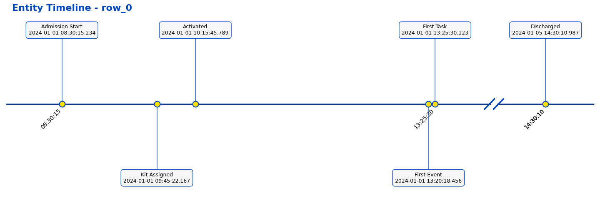

# timelineviz

[](https://pypi.org/project/timelineviz/)
[](https://pypi.org/project/timelineviz/)
[](LICENSE)

Timeline visualisation for CSV data and Prometheus test files.



## Features

- Plot event timelines from CSV / DataFrame timestamp data
- Handle time gaps with broken timeline display
- Auto-detect timestamp columns based on naming patterns
- **Visualise Prometheus `promtool` unit-test files** — series values, eval checkpoints, and alert checks on a relative time axis
- Customisable colour schemes
- CLI and Python API

## Installation

```bash
pip install timelineviz

# or with uv
uv add timelineviz
```

For development:

```bash
git clone https://github.com/garrywilliams/timeline_viz.git
cd timeline_viz
uv pip install -e ".[dev]"
```

## Quick Start

### CSV / DataFrame Timelines

```bash
# Auto-detect timestamp columns
timelineviz data.csv --detect-timestamps --output-dir timelines

# Specify columns explicitly
timelineviz data.csv --timestamp-columns created_at updated_at completed_at
```

```python
from timelineviz import plot_timeline, plot_multiple_timelines

import pandas as pd
df = pd.read_csv("data.csv")

# Single entity
plot_timeline(df.iloc[0],
              timestamp_columns=['created_at', 'updated_at', 'completed_at'],
              entity_id="12345")

# Multiple entities
plot_multiple_timelines("data.csv",
                        timestamp_columns=['created_at', 'updated_at'],
                        id_column='entity_id',
                        output_dir="timeline_images")
```

### Prometheus Test Timelines

Visualise `promtool` unit-test YAML files — see series values change over time, where evaluations happen, and when alerts fire.

```bash
timelineviz my_rules_test.yml --promtest
timelineviz my_rules_test.yml --promtest --output-dir images --no-show
```

```python
from timelineviz import parse_promtest_file, plot_promtest

groups = parse_promtest_file("my_rules_test.yml")
plot_promtest(groups, output_file="promtest_timeline.png")
```


Charts are self-documenting — each subplot shows the metric name and raw notation, value labels appear at transition points, eval/alert vertical lines are labelled, and a legend strip at the bottom explains all marker types.

> **Full guide:** [PROMTEST.md](PROMTEST.md) — notation reference, worked examples, and all parameters.

## How It Works

### CSV Timelines

Timestamps are plotted as labelled points along a horizontal axis. When time gaps exceed a threshold, the timeline is broken into segments with slash markers indicating the breaks.

### Promtest Timelines

Prometheus test files define metric series as values over discrete time steps (e.g. one value per minute). The library:

1. Parses the YAML and **expands the compact notation** (`1+2x5` → `1, 3, 5, 7, 9, 11`)
2. Plots each `input_series` as a **step chart** on its own subplot
3. Draws **vertical markers** at `eval_time` checkpoints
4. Shows **alert check points** with firing/pending status
5. Labels the x-axis with **relative time offsets** (`0s`, `1m`, `2m`, …)

## API Reference

### CSV Mode

| Parameter | Description |
|-----------|-------------|
| `timestamp_columns` | Columns containing timestamp data to visualise |
| `id_column` | Column that uniquely identifies each entity |
| `threshold_days` | Time gap (in days) that triggers a timeline break |
| `entity_name` | Type name for titles (e.g. "Patient", "Order") |
| `label_mappings` | Custom display names for timestamp columns |
| `color_scheme` | Dictionary of colour overrides |

### Promtest Mode

| Parameter | Description |
|-----------|-------------|
| `figsize` | Figure dimensions `(width, height)` in inches |
| `title` | Custom figure title |
| `color_scheme` | Override colours (see [PROMTEST.md](PROMTEST.md#colour-scheme)) |
| `output_file` | Save to PNG |
| `dpi` | Resolution (default 150) |

## License

[MIT](LICENSE)
